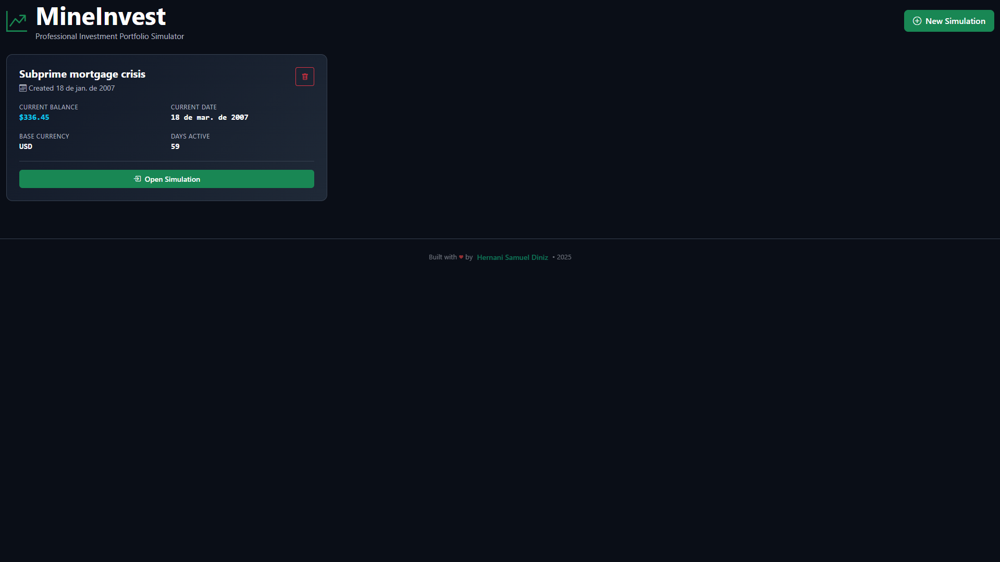
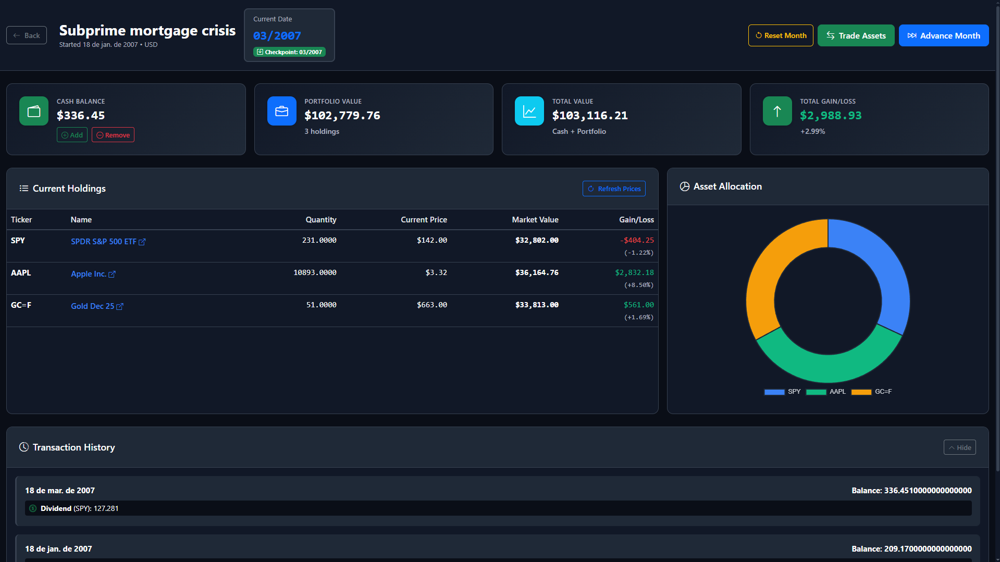
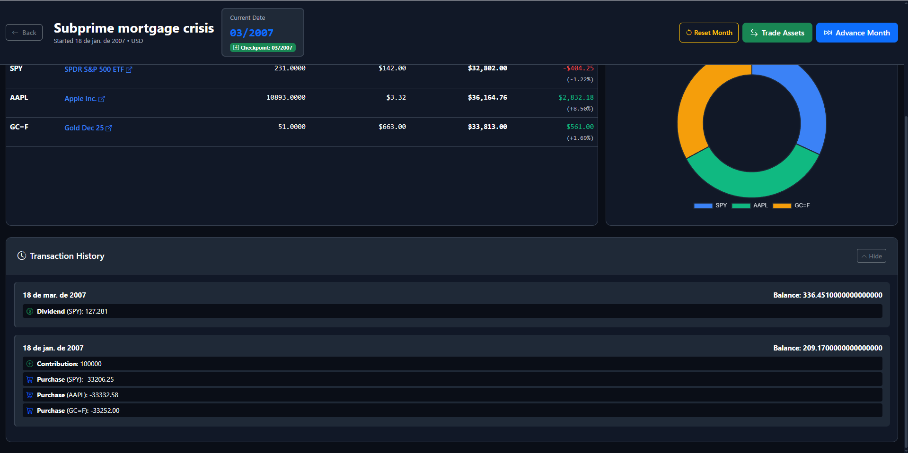
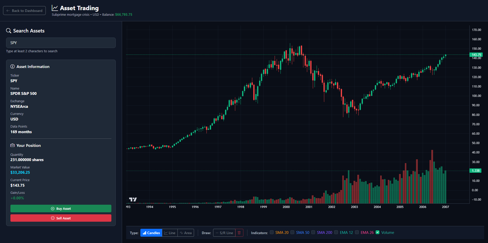

# 🚀 MineInvest

**Professional Investment Portfolio Simulator with Time Travel**

> Test investment strategies by traveling back in time with real historical market data from B3 (Brazilian Stock Exchange) and global markets.


---

## 📸 Screenshots

### Dashboard - Simulations List

*Manage multiple investment simulations with different starting dates and strategies*

### Simulation View - Portfolio Dashboard

*Track your cash balance, portfolio value, and asset allocation in real-time*

### Transaction History

*Complete audit trail of all operations, dividends, and balance changes*

### Advanced Trading Interface

*Professional charting with candlesticks and technical indicators*

---

## ✨ Features

### 🕰️ **Time Travel Backtesting**
- Start from **any date in history** - not just 2008, go back to when the asset started trading!
- Advance month by month through real market history
- See actual historical prices and dividends
- Test strategies that span decades

### 💰 **Real Market Data**
- Monthly data from **Yahoo Finance API**
- **All assets available on Yahoo Finance** - stocks, ETFs, crypto, commodities
- Search by **ticker or company name**
- Support for B3 stocks (add `.SA` suffix, e.g., PETR4.SA)
- Support for US stocks (NYSE, NASDAQ)
- International markets support
- Automatic dividend payments

### 💾 **Checkpoint System**
- Automatic checkpoint before each month advance
- Restore to previous checkpoint like a video game
- Test different strategies without consequences
- Undo risky moves instantly

### 📊 **Advanced Trading Interface**
- **Interactive Charts** with three display modes:
  - 📈 **Candlestick** - Full OHLC data visualization
  - 📉 **Line Chart** - Clean price trend view
  - 📊 **Volume** - Trading volume analysis
- **Technical Indicators**:
  - Horizontal support/resistance lines
  - SMA 20, 50, 200 (Simple Moving Averages)
  - EMA 12, 26 (Exponential Moving Averages)
  - Volume overlay
- Real-time asset search with autocomplete
- Historical price data for analysis

### 💼 **Portfolio Management**
- **Dashboard Overview**:
  - Cash balance with add/remove options
  - Total portfolio value tracking
  - Individual asset performance
  - Gain/loss calculations with percentages
- **Asset Allocation Pie Chart**
- Current holdings with detailed metrics
- Transaction history with full audit trail

### 🎨 **Modern Interface**
- Dark mode optimized for long sessions
- Responsive design for all screen sizes
- Intuitive user experience
- Professional financial dashboard aesthetic
- Clean, distraction-free trading environment

---

## 🎯 Use Cases

- **Backtest Strategies**: "What if I bought PETR4 in 2010 and held?"
- **Learn Without Risk**: Practice investing with real data, zero real money
- **Compare Approaches**: Test buy-and-hold vs. active trading
- **Train Discipline**: Experience market volatility in a safe environment
- **Content Creation**: YouTubers can create "testing strategies" videos

---

## 🛠️ Tech Stack

### Backend
- **Python 3.9+**
- **FastAPI** - Modern, fast web framework
- **SQLAlchemy** - Database ORM
- **yfinance** - Yahoo Finance API wrapper
- **SQLite** - Lightweight database

### Frontend
- **React 18** - UI library
- **Vite** - Build tool
- **Bootstrap 5** - UI components
- **Chart.js** - Data visualization
- **Lighweight Charts** - Asset monthly prices visualization
- **Axios** - HTTP client

---

## 📥 Installation

### Prerequisites

Before you begin, ensure you have installed the following **exact or higher versions**:

- **Python 3.13.7+** (recommended: 3.13.7) - [Download here](https://www.python.org/downloads/)
- **Node.js v22.19.0+** (recommended: v22.19.0) - [Download here](https://nodejs.org/)
- **Git 2.51.0+** (recommended: 2.51.0) - [Download here](https://git-scm.com/)

You can verify your installations:
```bash
python --version   # Should show Python 3.13.7 or higher
node --version     # Should show v22.19.0 or higher
git --version      # Should show git version 2.51.0 or higher
```

### Step 1: Clone the Repository

```bash
git clone https://github.com/HernaniSamuel/MineInvest.git
cd mineinvest
```

### Step 2: Backend Setup

```bash
# Create a virtual environment
python -m venv venv

# Activate the virtual environment
# On Windows:
venv\Scripts\activate
# On Linux/Mac:
source venv/bin/activate

# Install Python dependencies
pip install -r requirements.txt
```

**Note:** Keep this terminal open with the virtual environment activated for running the backend.

### Step 3: Frontend Setup

```bash
# Navigate to frontend directory
cd src/frontend-react

# Install Node.js dependencies
npm install

# Return to project root
cd ../..
```

### Step 4: Database Initialization

The SQLite database will be created automatically on first run. No manual setup needed!

---

## 🚀 Running the Application

You need to run **both** backend and frontend servers simultaneously.

### Quick Start (Two Terminal Windows)

**Terminal 1 - Backend Server:**
```bash
# Activate virtual environment (if not already activated)
# Windows:
venv\Scripts\activate
# Linux/Mac:
source venv/bin/activate

# Start backend from project root
uvicorn src.backend.main:app --reload
```

Backend will run at: `http://localhost:8000`

**Terminal 2 - Frontend Server:**
```bash
# Navigate to frontend directory
cd src/frontend-react

# Start frontend development server
npm run dev
```

Frontend will run at: `http://localhost:5173` and open automatically in your browser.

**That's it!** The application is now running. 🎉

### Alternative: Using the Startup Script (Advanced)

For convenience, you can create an automated startup script.

Create a `start.py` file in the project root:

```python
import subprocess
import sys
import time
from pathlib import Path

def start_backend():
    print("🚀 Starting Backend...")
    return subprocess.Popen(
        [sys.executable, "-m", "uvicorn", "src.backend.main:app", "--reload", "--port", "8000"]
    )

def start_frontend():
    print("🎨 Starting Frontend...")
    frontend_dir = Path(__file__).parent / "src" / "frontend-react"
    npm_cmd = "npm.cmd" if sys.platform == "win32" else "npm"
    return subprocess.Popen([npm_cmd, "run", "dev"], cwd=frontend_dir)

if __name__ == "__main__":
    try:
        backend = start_backend()
        time.sleep(2)
        frontend = start_frontend()
        print("\n✅ Both servers running!")
        print("📡 Backend:  http://localhost:8000")
        print("🎨 Frontend: http://localhost:5173")
        print("\nPress Ctrl+C to stop\n")
        while True:
            time.sleep(1)
    except KeyboardInterrupt:
        print("\n🛑 Shutting down...")
        backend.terminate()
        frontend.terminate()
        sys.exit(0)
```

Then run:
```bash
python start.py
```

---

## 📖 User Guide

### Main Dashboard

When you open MineInvest, you'll see your **simulations list**. Each simulation is independent with its own:
- Starting date and current date
- Cash balance
- Portfolio holdings
- Transaction history

### Simulation View

After opening a simulation, you have access to:

#### 1. **💰 Cash Management**
- **Add Money**: Inject capital into your simulation (contributions)
- **Remove Money**: Withdraw funds (withdrawals)
- Track your total cash balance

#### 2. **⏮️ Reset Month**
- Restore to the last automatic checkpoint
- Undo the most recent month advance
- Perfect for testing "what if" scenarios

#### 3. **📈 Trade Assets**
Opens the advanced trading interface where you can:
- **Search Assets**: Find any stock, ETF, or asset on Yahoo Finance
  - Search by ticker (e.g., `AAPL`, `PETR4.SA`)
  - Search by company name (e.g., `Apple`, `Petrobras`)
- **View Charts**: Analyze price history with:
  - **Candlestick view**: Full OHLC data with green (up) and red (down) candles
  - **Line chart**: Simple price trend visualization
  - **Volume bars**: Trading volume analysis
- **Technical Indicators**:
  - **Horizontal Line**: Draw custom support/resistance levels
  - **SMA 20/50/200**: Simple Moving Averages for trend analysis
  - **EMA 12/26**: Exponential Moving Averages for faster signals
  - **Volume**: Overlay trading volume on price chart
- **Buy/Sell**: Execute trades at historical prices

#### 4. **⏭️ Advance Month**
- Move forward one month in time
- Automatically:
  - Updates all asset prices to historical values
  - Pays dividends (if applicable)
  - Creates a checkpoint for undo capability
- Track your portfolio evolution over time

#### 5. **📊 Portfolio Overview**
- View all your current holdings
- See individual asset performance
- Track total portfolio value
- Analyze asset allocation with pie chart
- Review complete transaction history

### Creating Your First Simulation

1. **Click "New Simulation"** from the dashboard
2. **Enter Details**:
   - **Name**: Choose a memorable name (e.g., "Warren Buffett Strategy 2010")
   - **Start Date**: Pick any historical date (can go back decades!)
   - **Base Currency**: BRL (R$) or USD ($)
3. **Add Initial Capital**: Click "Add Money" and enter your starting amount
4. **Start Trading!**: Click "Trade Assets" to buy your first stock

---

## 📊 Supported Markets & Assets

MineInvest supports **all assets available on Yahoo Finance**, including:

### 🇧🇷 Brazil (B3)
Add `.SA` suffix to ticker symbols:
- `PETR4.SA` - Petrobras PN
- `VALE3.SA` - Vale ON
- `ITUB4.SA` - Itaú Unibanco PN
- `BBDC4.SA` - Bradesco PN
- `MGLU3.SA` - Magazine Luiza ON
- `WEGE3.SA` - WEG ON
- And **all other B3 stocks**

### 🇺🇸 United States (NYSE/NASDAQ)
Use ticker directly:
- `AAPL` - Apple Inc.
- `MSFT` - Microsoft Corporation
- `TSLA` - Tesla Inc.
- `GOOGL` - Alphabet Inc. (Google)
- `AMZN` - Amazon.com Inc.
- `NVDA` - NVIDIA Corporation
- And **all other US stocks**

### 🌍 International Markets
- **European stocks**: Add appropriate suffix (e.g., `.L` for London)
- **Asian markets**: Use Yahoo Finance format
- **ETFs**: All major ETFs (SPY, QQQ, IVV, etc.)
- **Commodities**: Gold (GC=F), Oil (CL=F), etc.
- **Cryptocurrencies**: BTC-USD, ETH-USD, etc.

### 📅 Historical Data Availability

- Data goes back **as far as the asset has been trading**
- Most major stocks: data from IPO date
- Some assets have data from the 1960s-1970s
- Data quality depends on Yahoo Finance availability

**Pro Tip**: Check the asset on [finance.yahoo.com](https://finance.yahoo.com) to see available date range before starting your simulation.

---

## 💡 Tips & Best Practices

### For Content Creators
- Create "testing strategies over X years" videos
- Compare different investment approaches
- Show real historical data to educate viewers

### For Learners
- Start with familiar companies
- Test emotional discipline during market crashes
- Practice position sizing and risk management
- Learn from mistakes in a safe environment

### For Strategy Testing
- Use checkpoints liberally to test variations
- Track your decision-making process
- Compare buy-and-hold vs. active trading
- Test different allocation strategies

---

## 🐛 Troubleshooting

### Backend won't start

**Error: "Port 8000 already in use"**
```bash
# Windows - Kill process on port 8000
netstat -ano | findstr :8000
taskkill /PID <PID> /F

# Linux/Mac - Kill process on port 8000
lsof -ti:8000 | xargs kill -9
```

**Error: "No module named 'fastapi'"**
```bash
# Make sure virtual environment is activated
# Windows: venv\Scripts\activate
# Linux/Mac: source venv/bin/activate

# Reinstall dependencies
pip install -r requirements.txt
```

### Frontend won't start

**Error: "command not found: npm"**
- Install Node.js from https://nodejs.org/

**Error: Dependencies issues**
```bash
cd src/frontend-react
rm -rf node_modules package-lock.json
npm install
```

### Data Issues

**Stock not found**
- Check if ticker exists on Yahoo Finance
- Some stocks may not have data before certain dates

**Prices seem incorrect**
- Data comes from Yahoo Finance - may have gaps
- Some historical data may be adjusted for splits
- Check the source ticker on finance.yahoo.com

---

## 🗺️ Roadmap

Future features being considered:

- [ ] **Portfolio Performance Charts** - Visual growth over time
- [ ] **Share Simulations** - Export/import simulation files (.minvest)
- [ ] **Benchmark Comparison** - Compare with IBOV, S&P500
- [ ] **Executable Software** - Just install MineInvest.exe and use it

**Got ideas?** [Open an issue](../../issues) or contribute!

---

## 📄 License

This project is licensed under the **Apache License 2.0** - see the [LICENSE](LICENSE) file for details.

Copyright © 2025 Hernani Samuel Diniz

---

## 🙏 Acknowledgments

- **Market Data** by [Yahoo Finance](https://finance.yahoo.com/) via [yfinance](https://github.com/ranaroussi/yfinance)
- **Icons** by [Bootstrap Icons](https://icons.getbootstrap.com/)
- **Charts** by [Chart.js](https://www.chartjs.org/) and [Lightweight Charts](https://www.tradingview.com/lightweight-charts/)
- Inspired by the need for better investment education tools

---

## 👤 Author

**Hernani Samuel Diniz**

- 🌐 Portfolio: [hernanisamuel.github.io/meu_portfolio](https://hernanisamuel.github.io/meu_portfolio/)
- 💼 GitHub: [@hernanisamuel](https://github.com/hernanisamuel)
- 📧 Contact: hernanisamuel0@gmail.com

---

## ⭐ Support

If you find MineInvest useful, please consider:

- ⭐ **Starring** this repository
- 🐛 **Reporting** bugs and issues
- 💡 **Suggesting** new features
- 🔀 **Contributing** code improvements
- 📢 **Sharing** with others who might benefit

---

<div align="center">

**Built with ❤️ for the investment community**

*Don't bet, get set.*

[🚀 Get Started](#-installation) • [📖 Documentation](#-quick-start-guide) • [🐛 Report Bug](../../issues) • [✨ Request Feature](../../issues)

</div>